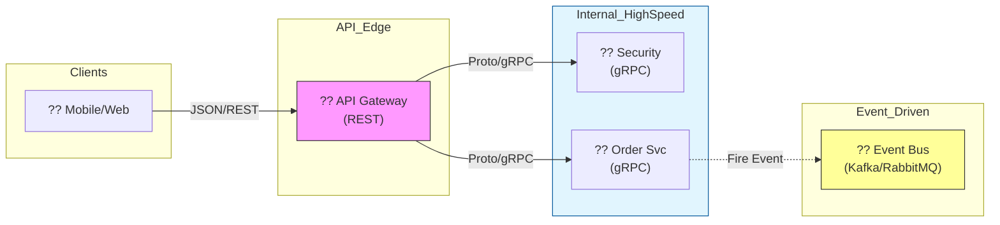

  

  # ?? Microservices 101: Mimari Manifesto & Teknoloji Rehberi
  ### Stratejik Karar Verme ve Sistem Tasarm Uzmanl
  
  
  
  
  

  **"Sadece kodlamayı değil, daltk dnyanın karmaııklığını nasıl yoneteceini oren."**

  ---

## ?? Mikroservis Mimarisi: Kökenler ve Evrim

Mikroservis, bir gecede ortaya cıkmıs bir fantezi deildir; monolitik sistemlerin "leklenemezlik" krizine bir cevaptır.

### ?? Tarihçe (Chronology)
- **2011 (Venice Workshop):** "Micro-services" terimi ilk kez bir yazlm mimarları toplantısında telaffuz edildi.
- **2012 (James Lewis):** Bu mimariyi "Microservices" olarak adlandırıp Case Study olarak sundu.
- **2014 (Martin Fowler & James Lewis):** Mikroservislerin altın çaını baslatan meşhur makale yayınlandı. Monolitik devir resmen sarsıldı.
- **2015+ (Cloud Era):** Docker ve Kubernetes'in yukselisiyle mikroservisler endstri standardı haline geldi.

---

## ?? Devlerin Savaşı: Teknoloji Karşılaştırmaları

Mikroservis dünyasında "En İyi" yoktur, "İhtiyaca En Uygun" vardır. İşte kritik savaslar:

### 1. Haberleşme: gRPC vs REST
| Ozellik | gRPC (Google RPC) | REST (HTTP/1.1) | Winner? |
| :--- | :--- | :--- | :--- |
| **Hız** | ?? Ultra Hızlı (Binary) | ?? Orta (Text-based) | **gRPC** |
| **Format** | Protocol Buffers | JSON / XML | **gRPC** |
| **Kullanım** | Servisler Arası (İç) | Client-Server (Dış) | **DURUMA GORE** |
| **Browser** | Zayıf Destek | Tam Destek | **REST** |

### 2. Mesajlama: Kafka vs RabbitMQ
| Ozellik | Apache Kafka | RabbitMQ | Winner? |
| :--- | :--- | :--- | :--- |
| **Trafik** | ?? Milyarlarca Mesaj | ?? Yuksek Trafik | **Kafka** |
| **Mantık** | Log-based (Stream) | Queue-based (Kuyruk) | **Berabere** |
| **Yapı** | Pub/Sub (Olay Odaklı) | Akıllı Yonlendirme | **RabbitMQ** |
| **Kullanım** | Big Data / Event Store | Task Queue / RPC | **DURUMA GORE** |

### 3. Orkestrasyon: Kubernetes vs Docker Swarm
- **Kubernetes (K8s):** Karmaıktır ama her şeyi yonetir. (Google'ın mimarisi). **Büyük sistemler iin tek tercih.**
- **Docker Swarm:** Basittir, ogrenmesi kolaydır. **Kucuk/Orta olcekli projeler iin ideal.**
- **HashiCorp Nomad:** K8s'e gore cok daha hafiftir, sadece "Job" odaklıdır.

### 4. Veritabanı: SQL vs NoSQL
- **PostgreSQL (SQL):** İlişkisel veri, katı tutarlılık (ACID). (Order, User, Payment servisleri).
- **MongoDB / Cassandra (NoSQL):** Yatay lekleme, esnek şema. (Product Catalog, Log, Tracking servisleri).

---

## ?? Reponun Amacı & Misyonu

Bu depo (microservices-101), senin için sadece bir "Tutorial" deildir. Amacımız:
1.  **Doru Silahı Seç:** Hangi teknolojiyi ne zaman kullanman gerektiğini ogretmek.
2.  **Maliyet Optimize Et:** Gereksiz yere Kafka kullanıp server faturasını artırmanı engellemek.
3.  **Elite Architect Yetistir:** Sektorde "Her iie mikroservis yapalım" diyen deil, "Burada monolit daha iyi olur" diyebilecek bilinçte mimarlar yetistirmek.

---

## ?? Mimari Görünüm (Strategy Map)

---

  Elite Microservices Architect Journey ?? <b>arch-yunus</b>

