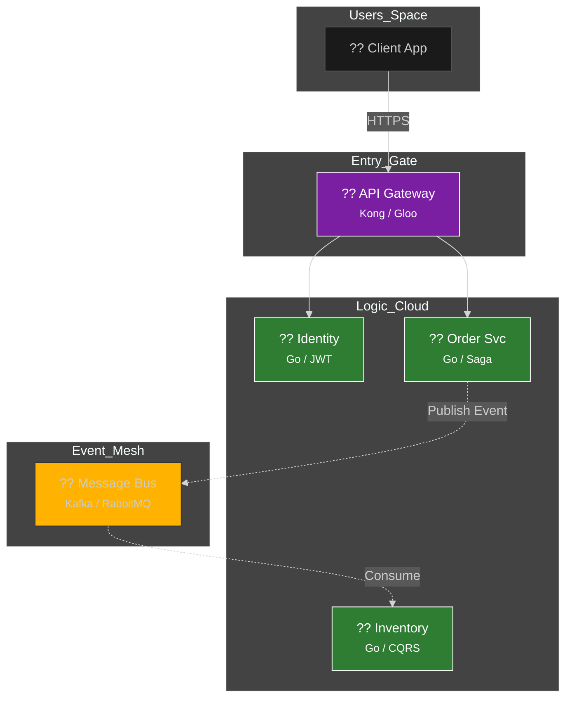

  

  # ?? Microservices 101: Mimari Manifesto
  ### Daıtık Sistemlerin Elite Rehberi & Pratik Uygulama Kampı
  
  
  
  
  

  **"Geleceğin dünyasını kucuk, bamsz ve otonom paralarla ina ediyoruz."**

  [? Yol Haritas](#-yol-haritas) • [?? Teknik Derin Dalı](#-teknik-derin-dal) • [?? Mimari](#-mimari-görünüm) • [?? Basit Anlatım](docs/KOLAY-ANLATIM.md) • [?? Katkıda Bulunma](CONTRIBUTING.md)

  ---

## ?? Vizyon & Felsefe

Bu depo, monolitik yapıların hantallığından kurtulup, bulut-yerli (cloud-native) bir sistem mimarı olma yolunda ilerlemek isteyenler için tasarlanmış **Elite** bir eğitim serüvenidir. 

> [!IMPORTANT]
> Mikroservis bir teknoloji seçimi değildir; bir **organizasyonel strateji** ve **mühendislik disiplini**dir. Bu depoda sadece kod yazmıyoruz, sistem tasarlıyoruz.

---

## ?? Teknik Derin Dalı (Deep Dives)

Aşağıdaki başlıklar, modern mikroservis mimarisinin can damarıdır. Her birini detaylıca incelemek için tıkla kanka. ??

<b>?? 1. Conway Kanunu & Organizasyonel Yapı</b>

 
Conway Kanununa göre, yazlm mimarisi organizasyonun iletisim yapısını yansıtır. Mikroservis baısı iin ekibinizi "Two-Pizza Teams" (6-8 kisilik otonom ekipler) haline getirmelisiniz. Otonom ekipler yoksa, otonom servisler de yoktur.

<b>?? 2. 12-Factor App Prensipleri</b>

 
Modern bir mikroservisin "Cloud-Native" olması iin u kurallara uyması gerekir. siferelerin Environment Variables'da tutulması (Config), uygulamanın "Stateless" olması (Processes) ve logların birer olay akıı olarak ele alınması (Logs) bu anayasanın temelidir.

<b>?? 3. Veri Yönetimi: Database per Service & CQRS</b>

 
Her servisin kendi veritabanı olmalıdır. Yazma (Command) ve Okuma (Query) islemlerini paralamak (CQRS) yuksek trafikli sistemlerde hayat kurtarır. Veri tutarlılıı iin Event-Driven Communication kullanıyoruz.

<b>?? 4. Saga Pattern & Distributed Transactions</b>

 
Daltık bir sistemde atomik transaction yoktur. Bir islem patlarsa, daha onceki islemleri geri alacak "Compensating Transactions" (Telafi İslemleri) devreye girer. Saga, daltık dnyanın ROLLBACK mekanizmasıdır.

<b>?? 5. Resilience: Circuit Breaker & Chaos Engineering</b>

 
Servisler ker. Circuit Breaker, patlayan bir servise gıden yolu kapatarak tm sistemin cokmesini kilitler. Chaos Engineering (Chaos Monkey) ile canlı ortamda servisleri kapatıp sistemin kendini iyilestirmesini test ederiz.

---

## ?? Eğitim Yol Haritas (Roadmap)

Seni bir sistem mimarına dnsturecek progress tablosu:

| Aşama | Modl | Odak Noktası | Durum |
| :--- | :--- | :--- | :---: |
| ?? **Faz 1** | [Giris](docs/01-intro/README.md) | Paradigma Deıişimi & Temeller |  |
| ?? **Faz 2** | [Decomposition](docs/02-decomposition/README.md) | DDD & Servis Parçalama |  |
| ?? **Faz 3** | [Communication](docs/03-communication/README.md) | gRPC & Event-Driven Archi. |  |
| ?? **Faz 4** | [Data Management](docs/04-data-management/README.md) | Saga Pattern & CQRS |  |
| ?? **Faz 5** | API Gateway | Security & Rate Limiting |  |
| ?? **Faz 6** | Observability | Distributed Tracing & Metrics |  |

---

## ?? Mimari Görünüm

Modern bir daltık sistemin anatomi haritası:

---

## ?? Neden Go (Golang)?

Neden mikroservis dnyasının "Lider Dili" Go?
- **Ultra-Lightweight:** saniyeler içinde kalkan containerlar.
- **Concurrency:** Goroutines ile binlerce e-zamanlı islem.
- **Type Safety:** Hata payını minimize eden guclu tip sistemi.

---

## ?? Katkda Bulunma

Bu bir topluluk ve geliim projesidir. Sen de bu manifestoya katkda bulunabilirsin!
?? **[CONTRIBUTING.md](CONTRIBUTING.md)** belgesine goz at.

---

   
  
   
  Mastering Microservices Architecture ?? <b>arch-yunus</b>

