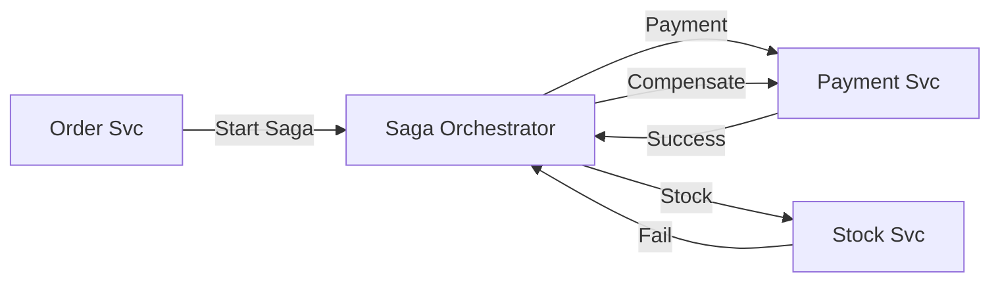

<div align="center">
  

  # Microservices 101: Mimari Mühendislik ve Tasarım Ansiklopedisi
  ### Dağıtık Sistemlerde Uzmanlaşmak İçin Temel Kaynak
  
  [](LICENSE)
  [](https://go.dev)
  [](https://github.com/arch-yunus/microservices-101)

  **"Mükemmel bir mimari, sadece çalışan kod değil; öngörülebilen, ölçeklenebilen ve evrimleşebilen bir yapıdır."**

  ---
</div>

## Giriş: Mikroservis Ekosistemine Bakış

Mikroservis mimarisi, devasa ve yönetilmesi imkansız hale gelen monolitik sistemlerin yarattığı hantallığa bir çözümdür. Ancak bu mimari "bedava" değildir; beraberinde dağıtık sistemlerin karmaşıklığını getirir. Bu rehber, sizi bu karmaşıklığın içinde bir usta (Architect) gibi yönetmeye hazırlayacaktır.

---

## Bölüm 1: Monolit Krizi ve Mikroservise Geçiş Stratejileri

Yazılım dünyasında hiçbir dev sistem bir gecede mikroservis olarak doğmaz. Genellikle bir Monolit'in sınırlarını zorlamasıyla başlar.

### Strangler Fig (Boğucu İncir) Deseni
Eski bir sistemi (Monolith) tamamen yıkıp yeniden yazmak yerine, servisleri birer birer dışarı çıkarıp trafiği yavaşça yeni servislere yönlendirme stratejisidir. 
- **Zamanla:** Yeni servisler monolitik yapıyı "boğar" ve sonunda eski yapı tamamen devre dışı kalır.

---

## Bölüm 2: İleri Seviye Tasarım Kalıpları (Design Patterns)

Mikroservisler arası bağımlılığı ve hata yayılımını (Cascading Failure) önlemek için şu kalıplar hayati önem taşır:

### 1. Circuit Breaker (Sigorta Deseni)
Bir servis sürekli hata veriyorsa, diğer servislerin onu aramaya devam edip kendilerini kitlemesini önler.
- **Kapalı (Closed):** Normal akış.
- **Açık (Open):** Hata eşiği aşılırsa, isteklere anında "Hata var" döner, hedef servisi yormaz.
- **Yarı Açık (Half-Open):** Servisin düzelip düzelmediğini anlamak için arada birkaç deneme yapar.

### 2. Bulkhead (Bölme Deseni)
Gemi ambarlarındaki bölmeler gibi, bir servisteki bir modülün çökmesinin tüm servisi veya sistemi etkilemesini önlemek için kaynakları (Thread pools, CPU) izole etmektir.

---

## Bölüm 3: Karar Matrisleri ve Teknoloji Kıyaslama

"En iyi teknoloji" yoktur, "ihtiyaca en uygun çözüm" vardır.

### İletişim Protokolleri
| Protokol | Hız / Performans | Kullanım Alanı | Zorluk |
| :--- | :--- | :--- | :--- |
| **REST/JSON** | Orta | Dış dünya, Mobil uygulamalar | Düşük |
| **gRPC/Proto** | **Çok Yüksek** | **Dahili (Svc to Svc)** | Orta |
| **GraphQL** | Esnek | Dinamik veri ihtiyacı olan UIlar | Yüksek |

### Mesajlaşma (Brokers)
- **RabbitMQ**: Akıllı yönlendirme (routing) gerektiren, anlık iş kuyrukları için idealdir. (Push-based)
- **Kafka**: Devasa veri akışları (streaming), olay kaydı (event sourcing) ve yüksek hacimli loglama için rakipsizdir. (Pull-based)

---

## Bölüm 4: Veri Yönetimi ve Saga Topolojileri

Mikroservislerde en büyük zorluk veridir. Atomik bir `UPDATE` her zaman mümkün değildir.

### Saga Deseni (Dağıtık Transaction)
1. **Koreografi (Choreography):** Her servis bir iş yapınca "Event" fırlatır. Diğerleri bu event'i duyup kendi işini yapar. Merkezi bir yönetici yoktur. (Küçük sistemler için ideal).
2. **Orkestrasyon (Orchestration):** Bir "Saga Manager" vardır. Tüm süreci o yönetir. Hangi adımın bittiğini ve kimin hata yaptığını o bilir. (Karmaşık iş süreçleri için şarttır).



---

## Bölüm 5: Mikroservis Anti-Patterns (Kaçınılması Gerekenler)

Dünya çapındaki binlerce başarısız projenin ortak hataları:
- **Dağıtık Monolit (Distributed Monolith):** Servisleri ayırıp hepsini aynı veritabanına bağlamaktır. Sıkı bağlılığı (Coupling) asla bitirmez.
- **Nano-Services:** Sistemi aşırı parçalayıp (her fonksiyon için bir servis) yönetilemez bir ağ trafiği yaratmaktır.
- **Gizli Bağımlılık (Hidden Coupling):** Servislerin birbirinin kütüphanelerine (Shared Library) kod seviyesinde bağımlı olması.

---

## Bölüm 6: Ölçekleme ve Gözlemlenebilirlik (The Three Pillars)

Bir mikroservis ordusunu yönetmek için gözünüzün kulağınızın açık olması lazımdır.
- **Metrics (Metrikler):** "Kaç istek aldım? RAM ne durumda?"
- **Logging (Loglama):** "Neler oldu?" (Merkezi Loglama - ELK Stack).
- **Tracing (İzleme):** "Bir sipariş isteği 10 servis arasında nerede takıldı?" (Distributed Tracing - Jaeger).

### Ölçekleme Stratejileri
- **Dikey (Vertical):** Mevcut makinenin RAM/CPU'sunu artırmak. (Limiti vardır).
- **Yatay (Horizontal):** Aynı servisten 10 tane daha kopyalamak. (Mikroservislerin asıl gücü budur).

---

## Laboratuvar: Uygulama ve Deney Rehberi

Deponuzda yer alan altyapıyı kullanarak bu kavramları bizzat test edin:

```bash
# 1. Altyapıyı Başlat (Database, RabbitMQ, Redis)
make up

# 2. API Gateway (Zırhlı Kapı) Çalıştır
cd services/gateway-service && go run cmd/api/main.go

# 3. İç Servisleri Uyandır
make run-product
make run-order
```

> [!TIP]
> Deney Önerisi: Bir servisi kapatın (örneğin Product) ve Gateway üzerinden istek attığınızda sistemin nasıl tepki verdiğini (Graceful Failure) izleyin.

---

## Mimari Yol Haritası (Mükemmeliyete Giden Yol)

| Adım | Konu | Odak Noktası | Durum |
| :--- | :--- | :--- | :---: |
| 1 | Temeller | Paradigma ve Evrim |  |
| 2 | Clean Architecture | Go Proje Standartları |  |
| 3 | İletişim | gRPC ve Protobuf |  |
| 4 | Güvenlik | API Gateway ve JWT |  |
| 5 | Dayanıklılık | Sigorta ve Bölme Kalıpları |  |
| 6 | Mesajlaşma | Event-Driven Tasarım |  |

<div align="center">
  <br/>
  <sub>Sürekli Gelişim ve Mühendislik Onuruyla | **arch-yunus**</sub>
</div>
