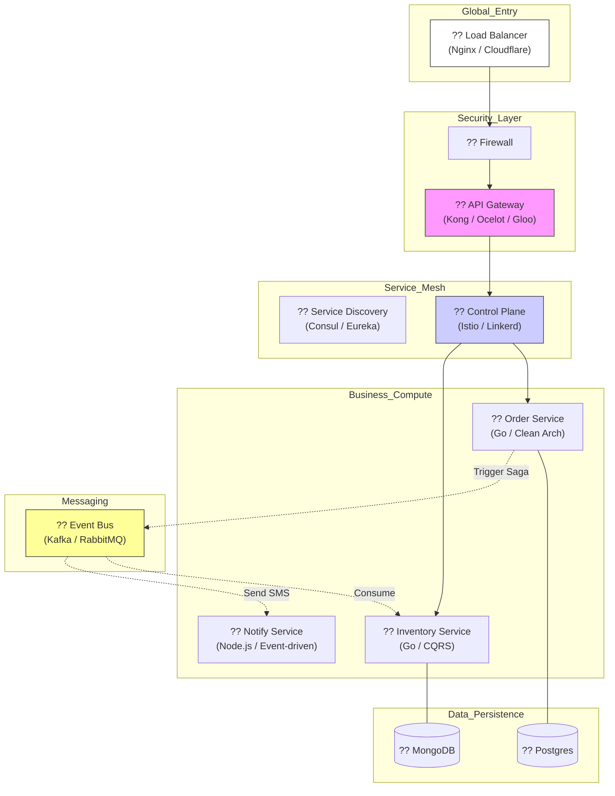

  

  # ?? Microservices 101: Nihai Sistem Mimarisi Rehberi (Ultimate Edition)
  ### Daıtık Sistemlerin Anatomisi ve Stratejik Yonetimi
  
  
  
  
  

  *Modern, daltık, yuksek leklebilir ve her an hata vermeye hazır (Design for Failure) sistemlerin profesyonel rehberi.*

  ---

## ?? Mikroservis Nedir? (Derinlemesine Felsefe)

Mikroservisler, devasa ve yonetilmesi imkansız hale gelen monolitik yazlm sistemlerini, her biri belirli bir **Business Domain**'e (İ Alan) odaklanan, tamamen otonom ve bamsz olarak daltlabilen "mikro-organizmalar" olarak tasarlama sanatıdır. 

Sıradan bir mikroservis tanımının otesinde, mikroservis **Otonomi** (Bamszlık) demektir. Bir servisi daltırken dier bir servisin hayatta olup olmaması sizin daltımınızı etkilememelidir. Eer etkiliyorsa, otonom deildir. Mikroservis, sistemin karmaşıklığını "Bol ve Fethet" (Divide and Conquer) prensibiyle kucuk, uzmanlasm ekiplerin yonetebilecei paralar haline getirir.

---

## ?? Conway Kanunu: Takım Yapısı ve Mimari Banlatısı

> "Sistemleri tasarlayan her organizasyon, o organizasyonun iletisim yapısını kopyalayan sistemler üretir." - Melvin Conway

Mikroservis mimarisine geçiş, sadece bir kod deisimi değil, bir **kltrel ve organizasyonel** devrimdir. Eer 100 kisilik tek bir ekibiniz varsa, monolitik bir sistem üretirsiniz. Mikroservis iin bu ekibi "Two-Pizza Teams" (İki pizzayla doyan, 6-8 kisilik otonom ekipler) haline getirmelisiniz. 

**Pro Tip:** Eer ekipleriniz bamsz deilse, mikroservisleriniz de bamsz olamaz. Mimari, ekibinizin yansmasıdır.

---

## ?? Mimari Evrim: Monolith'ten Mesh'e Giden Yol

1.  **Monolith (Geleneksel):** Tek bir `main.go` veya `jar` dosyası. Veritabanı tektir. Bir yer patlarsa her yer patlar. Ancak hatayı bulmak (Debug) kolaydır.
2.  **SOA (Service Oriented Architecture):** Servisler vardır ama genellikle devasa bir **ESB (Enterprise Service Bus)** üzerinden birbirine banlıdır. SOA'da servisler "paylasılan servisler"dir, mikroservislerde ise "bamsz otonom servisler"dir.
3.  **Microservices (Modern):** ESB'yi ortadan kaldırırız. Servisler arası iletisimi akıllı uç noktalar (Smart Endpoints) ve basit borular (Dumb Pipes) ile yonetiriz. Servisler deryadır; her biri kendi teknolojisini sebilir.

---

## ?? 12-Factor App: Bulut-Yerli (Cloud-Native) Uygulamanın Anayasası

1. **Codebase:** Tek bir depo, cok daltım. (Farklı branch'ler deil, aynı kodun farklı ortamlarda calıması).
2. **Dependencies:** Tüm baımlılıklar net tanımlanır. (Docker/Go Modules). Hiçbir ey "sistemde kurulu varsayılmaz".
3. **Config:** Ayarlar `config.yaml` deil, `Environment Variables`'larda tutulur. sifereler asla kod içinde olamaz.
4. **Backing Services:** DB, Log, Cache her ey banlanabilir kaynaktır. Deistirilmesi iin kod deismesine gerek olmamalıdır.
5. **Build, Release, Run:** Sureler kesin ayrılmalı. Build (Compile), Release (Config + Build), Run (Execution). Geriye donuk takip (Versioning) yapılabilir.
6. **Processes:** "Stateless" olmalı. Bir request'ten dierine veri taınmaz. Memory'de "Session" tutulmaz; bunun iin Redis kullanılır.
7. **Port Binding:** Uygulama kendi portunu darya açabilmeli; dısarıdaki bir "Web Server"ın (IIS/Apache) içinde calımaz.
8. **Concurrency:** İstekler arttıında tek bir root root process'i buyutmek (Vertical) yerine process sayısını artırırsın (Horizontal Scaling).
9. **Disposability:** Hizlı balayıp gvenli kapanmalı (SIGTERM). Bir container silindiinde veri kaybı olmamalı.
10. **Dev/Prod Parity:** Lokal ve prod ortam arası fark "Dı kaynaktır". Kod aynıdır.
11. **Logs:** Loglar birer "Stream"dir. Uygulama logu dosyaya yazmaz, `stdout`'a basar. dısarıdaki bir log collector (Fluentd) onları toplar.
12. **Admin Processes:** Database migration vb. iiler "Run" surecinin bir parasıdır.

---

## ?? Gelişmiş Mimari Patternlar (Derin İnceleme)

### 1. CQRS (Command Query Responsibility Segregation)
Veriyi yazan metod (Command) ile veriyi okuyan metod (Query) birbirinden ayrılır. 
- **Neden?** Okuma islemleri genellikle daha yuksek trafik alır (10:1 oranında). Okuma iin Elasticsearch gibi hızlı arama motorları, yazma iin PostgreSQL gibi tutarlı veritabanları kullanılır. Aradaki senkronizasyon "Event"lerle salanır.

### 2. Event Sourcing
Durumu deil, "Olayları" saklarız. 
- **Snapshot Tekniği:** Eer sistemde milyonlarca olay varsa, hepsini baştan oynatmak yavaş olur. Bu yuzden her 1000 olayda bir sistemin "Anlık Durumu"nu (Snapshot) kaydederiz. Hata analizi iin mukemmeldir.

### 3. Saga Pattern ve Compensating Transactions
Daltık bir sistemde "Sipari Olustur -> Stok Dştir -> Odeme Al" islemi atomik deildir. 
- **Scenario:** Odeme Servisi patlarsa ne olur? 
- **Compensating Transaction:** Odeme patladıı anda, Stok Servisi'ne "Stou geri artır" mesajı yollanır. Bu "Geriye Donme" (Undo) mantıı dağıtk sistemlerin can damarıdır.

---

## ?? Güvenlik: Katmanlı Savunma (Defense in Depth)

1. **Edge Security (API Gateway):** Kullanıcıyı "Kapı"da durdurun. JWT, OAuth2 ve Rate Limiting burada yapılır.
2. **mTLS (Mutual TLS):** Container'lar birbirine "Gerçekten kimsin?" diye sertifika sorar. "Servis Mesh" (Istio) bunu kod yazmadan halleder.
3. **Zero Trust:** Sadece "İç ağdayım" diyerek kimseye gvenilmez. Her servis, gelen isteın doru JWT'ye sahip olup olmadığını kontrol eder.

---

## ?? Gözlemlenebilirlik: 4 Altın Sinyal (Golden Signals)

1. **Latency:** Bir isteğin tamamlanma suresi. 
2. **Traffic:** Sisteme gelen istek sayıs (Request per Second).
3. **Errors:** Hatalı isteklerin tum isteklere oranı (5xx hataları).
4. **Saturation:** Kaynak kullanımı (CPU/RAM). Eer %90'daysanız, yakında Latency artacaktır.

---

## ?? Test Stratejisi: Test Piramidi (Microservices Edition)

- **Unit Test:** İ mantsal fonksiyonlar. 
- **Component Test:** Servisin tek basına (Dı dunyayı "Mock"layarak) calıması.
- **Contract Test (Pact):** Bir servisin dısına verdigi API'nin "Sozleimesi". A servisi degistiinde B servisi patlayacak mı? Bunu bilebilmenin tek yolu budur.
- **Chaos Engineering:** Netflix "Chaos Monkey"i nsanlara salar. Canlı ortamda rastgele servisleri kapatır ve sistemin kendi kendine iyilesip iyilesmedııni test eder.

---

## ?? Mimari Görünüm

---

## ?? Eğitim Yol Haritas (Roadmap)

| Modl | Konu | İeerik | Durum |
| :--- | :--- | :--- | :--- |
| **01** | [Giris](docs/01-intro/README.md) | Paradigma Değisimi & Neden Mikroservis? | ?? Tamamlandı |
| **02** | [Decomposition](docs/02-decomposition/README.md) | DDD, Bounded Context & Servis Parçalama | ?? Tamamlandı |
| **03** | [Communication](docs/03-communication/README.md) | gRPC, REST & Messaging Patterns | ?? Tamamlandı |
| **04** | [Data Management](docs/04-data-management/README.md) | Saga Pattern, CQRS & DB per Service | ?? Tamamlandı |
| **05** | API Gateway | Security, Rate Limiting & Auth | ?? Yaknda |
| **06** | Observability | Tracking, Metrics & Logging | ?? Yaknda |
| **07** | Deployment | Docker, K8s & Cloud Native CI/CD | ?? Yaknda |

---

  Mastering Microservices Architecture ?? <b>arch-yunus</b>

