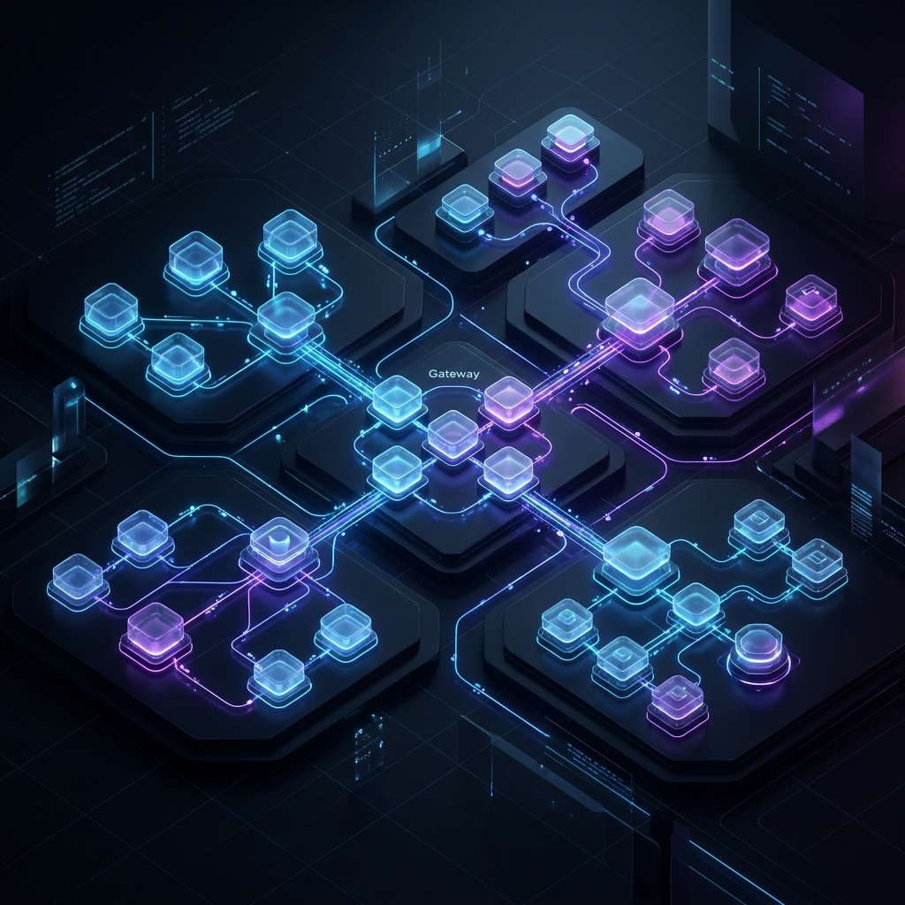
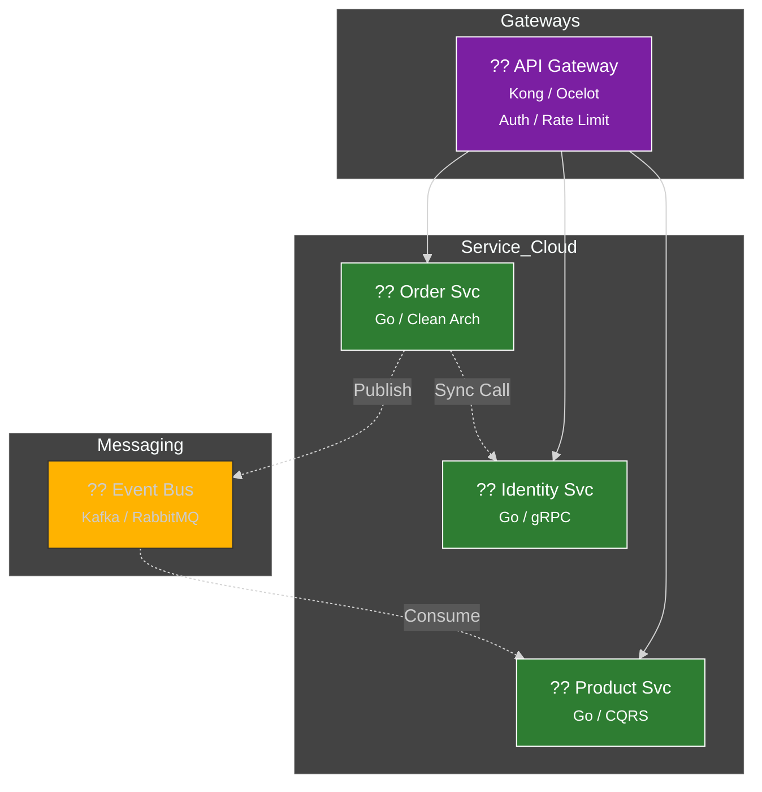

<div align="center">
  

  # ?? Microservices 101: Sistem Mimarisinin Nihai Anayasas
  ### Daıtık Sistemlerin Karanlık Dünyasında Stratejik Liderlik
  
  [](LICENSE)
  [](https://go.dev)
  [](#-mimari-görünüm)
  [](https://github.com/arch-yunus/microservices-101)

  **"Karmaşıklığı yönetmek bir yetenek, otonomiyi inşa etmek ise bir sanattır."**

  [?? Kolay Anlatım](docs/KOLAY-ANLATIM.md) • [?? Master Class](docs/MASTERCLASS.md) • [? Yol Haritas](#-eğitim-yol-haritas) • [?? Hızlı Başlangı](#-hızlı-başlangıç)

  ---
</div>

## ?? Vizyon & Felsefe: Neden Mikroservis?

Mikroservisler, devasa monolitik yapıların hantallığından kurtulup, saniyeler içinde daltılabilen ve bamsz leklenen otonom hcrelerin inşasıdır. Bu bir teknolojik tercih değil, milyar dolarlık trafiği yonetebilecek bir **organizasyonel strateji**dir. 

> [!IMPORTANT]
> Mikroservis mimarisi "Design for Failure" (Hata iin Tasarla) prensibiyle yaşar. Sistemde her an bir yerlerin çökeceini kabul eder ve sistemi bu cokuste bile ayakta kalacak şekilde zırhlandırırız.

---

## ?? Hızlı Başlangıç (Quick Start)

Sistemi saniyeler iinde ayaa kaldrmak iin terminalinizi hazrlayn:

```bash
# 1. Altyapıyı (DB, Message Broker) başlat
make up

# 2. Product Service'i çalıştır
make run-product

# 3. Order Service'i çalıştır (farklı bir terminalde)
make run-order
```

---

## ?? Teknik Derin Dalı (Architectural Deep Dives)

<details>
<summary><b>?? 1. Conway Kanunu ve Ters Conway Manevrası</b></summary>
<br/>
"Sistemler, tasarlayan organizasyonun iletisim yapısını kopyalar." **Inverse Conway Maneuver** kullanarak, hedeflediiniz mimariyi elde etmek iin once ekiplerinizi (Teams) bu mimariye gore paralamalısınız.
</details>

<details>
<summary><b>?? 2. Migration: Strangler Fig Pattern</b></summary>
<br/>
Bir Monolith'i mikroservise cevirmek iin her şeyi bir anda yıkmak intihardır. Bunun yerine trafik yava yava Monolith'ten yeni servislere akıtılarak Monolith "boğulur" (Strangled) ve yok edilir.
</details>

<details>
<summary><b>?? 3. Data Patterns: CQRS & Event Sourcing</b></summary>
<br/>
Okuma (Query) ve Yazma (Command) islemlerini paralarız. Verinin son halini değil, veriyi o hale getiren tum tarihsel olayları (Events) saklayarak kusursuz bir denetim (Audit) saglarız.
</details>

---

## ?? İleri Seviye Tasarım Kalıpları

- **Anti-Corruption Layer (ACL):** Legacy sistemlerin kirli verisini filtrelemek iin kullanılır.
- **Ambassador Pattern:** Servis dısı iletisimi (Retry, Logging) yoneten bir vekil sunucu.
- **Outbox Pattern:** Veritabanı islemi ve mesaj gonderimini atomik hale getirir.

---

## ?? Mimari Görünüm



---

## ?? Eğitim Yol Haritas (The Elite Roadmap)

| Aşama | Modl | Odak Noktası | Durum |
| :--- | :--- | :--- | :---: |
| ?? **Faz 1** | [Giris](docs/01-intro/README.md) | Paradigma Deıişimi |  |
| ?? **Faz 2** | [Decomposition](docs/02-decomposition/README.md) | DDD & Bounded Context |  |
| ?? **Faz 3** | [Communication](docs/03-communication/README.md) | gRPC & REST |  |
| ?? **Faz 4** | [Data Management](docs/04-data-management/README.md) | Saga & CQRS |  |
| ?? **Faz 5** | API Gateway | Security & OIDC |  |
| ?? **Faz 6** | Observability | Tracing & Metrics |  |
| ?? **Faz 7** | Cloud Native | Kubernetes & GitOps |  |

---

<div align="center">
  <br/>
  
  <br/>
  <sub>Achieving Architectural Excellence ?? <b>arch-yunus</b></sub>
</div>
