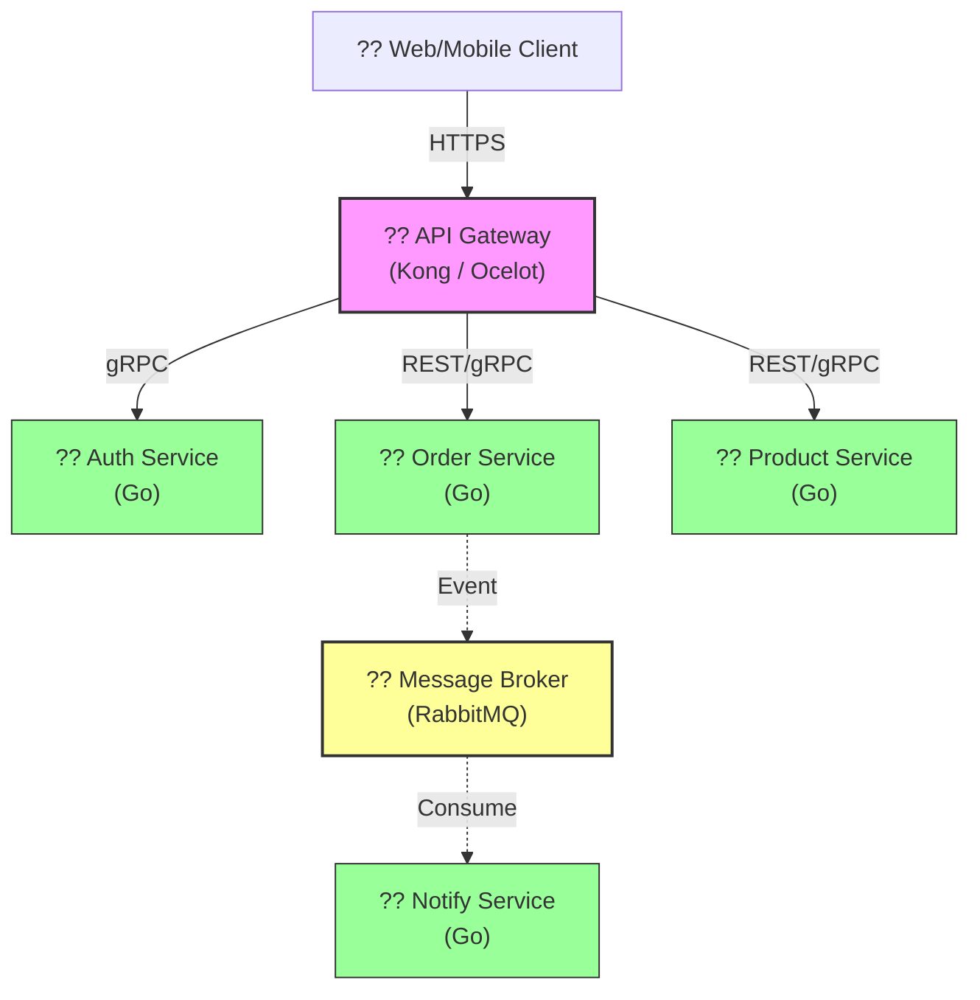

<div align="center">
  

  # ?? Microservices 101
  ### Sfrdan Datk Sistem Mimarisi Rehberi
  
  
  
  
  
  
  *Modern, leklenip ynetilebilir ve dayankl mikroservis sistemleri tasarlamann elite yol haritas.*

  [Roadmap](#-yol-haritas) | [Teknolojiler](#-teknolojiler) | [Mimari](#-mimari) | [Katkda Bulunma](CONTRIBUTING.md)

  ---
</div>

## ?? Vizyon

Bu depo, monolitik yaplarn kstlamalarndan kurtulup moderne gemek isteyen gelitiriciler ve sistem mimarlar iin hazrlanmtr. Sadece kod yazmay deil, bir sistemin **yaam dngsn**, **gvenliğini** ve **izlenebilirliğini** u seviyede ele almay hedefler.

> [!IMPORTANT]
> Mikroservis bir teknoloji deil, bir **stratejidir**. Bu rehberde amacmz sadece kodlamak deil, daltk bir sistemin karmaııklığını nasıl yoneteceğimizi oğrenmektir.

---

## ?? Yol Haritas (Roadmap)

Eğitim sreci, bir sistem mimarnn zihnindeki u ak takip eder:

| Modl | Konu | Durum |
| :--- | :--- | :--- |
| **01** | [Giris: Paradigma Değisimi](docs/01-intro/README.md) | ?? Tamamland |
| **02** | [Servis Parcalama & DDD](docs/02-decomposition/README.md) | ?? Tamamland |
| **03** | [Haberlesme Protokolleri](docs/03-communication/README.md) | ?? Tamamland |
| **04** | [Veri Yönetimi & Tutarllk](docs/04-data-management/README.md) | ?? Tamamland |
| **05** | API Gateway & Security | ?? Yaknda |
| **06** | Observability (Tracing & Metrics) | ?? Yaknda |
| **07** | CI/CD & Deployment (K8s) | ?? Yaknda |

---

## ?? Mimari Görünüm

Sistemin temel akını aşağıda görebilirsiniz:



---

## ?? Teknolojiler & Araclar

| Kategori | Arac | Badge |
| :--- | :--- | :--- |
| **Dil** | Go (Golang) |  |
| **İletişim** | gRPC / REST |  |
| **Gateway** | Kong / Ocelot |  |
| **Veritabanı** | PostgreSQL / Redis |  |
| **Broker** | RabbitMQ |  |
| **Gözlem** | Prometheus |  |

---

## ?? Baslangıc

Projeyi yerel ortamnzda ayağa kaldrmak iin:

```bash
# Repoyu klonlayn
git clone https://github.com/arch-yunus/microservices-101.git

# Altyap servislerini başlatın
docker-compose up -d
```

---

## ?? Lisans
Bu proje [MIT](LICENSE) lisansı ile korunmaktadr.

<div align="center">
  <sub>Built with ?? by <b>arch-yunus</b></sub>
</div>
