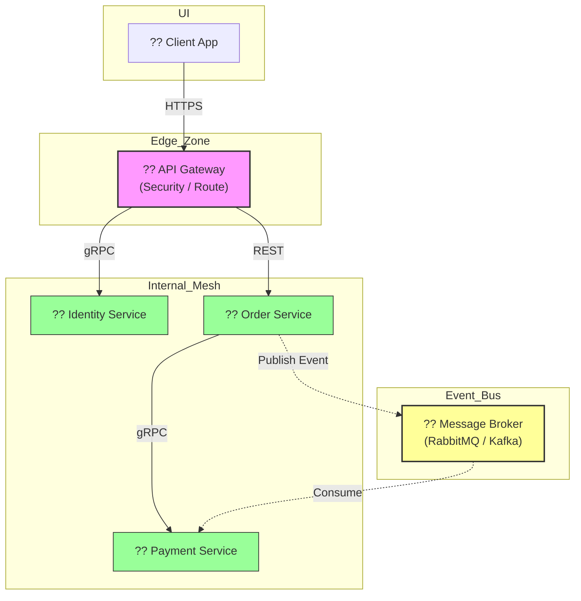

  

  # ?? Microservices 101: Sistem Mimarisi Manifestosu
  ### Daıtık Sistemlerin Karanlık Dünyasında Bir Fener
  
  
  
  

  *Modern, lakilip yonetilebilir ve "Self-Healing" yeteneğine sahip sistemler tasarlamann yol haritas.*

  ---

## ?? Mikroservis Nedir? (Gerçek Anlamda)

Mikroservisler, devasa bir yazlmı, her biri belirli bir i mantna (Business Logic) sahip, bamsz olarak daltlabilen ve leklenilebilen "kk otonom hcreler" olarak tasarlama sanatıdır. 

> [!CAUTION]
> Mikroservis "kk kod yazmak" deildir. Mikroservis, sistemin karmaşıklığını (Complexity) paralarına bolup, o paraları yonetilebilir kılmaktır. Eer paralar bamsz deilse, sadece "Daltık bir Monolith" yaratmsnz demektir.

---

## ?? Derin Dalış: Mimari Sütunlar

### 1. Servis Parcalama: Domain-Driven Design (DDD)
Mikroservislerin snırlarını rastgele değil, **Business Domain**'e gore belirleriz. 
- **Bounded Context:** Her servisin bir sınırları vardır. "Sipari" servisi iin urun sadece bir `ProductID` iken, "Katalog" servisi iin urun `Açıklama`, `Resim` ve `Kategori` demektir.
- **Ubiquitous Language:** Gelitirici ve İş birimi aynı dili konur.

### 2. Veri Yönetimi: Database per Service
Her servisin kendi veritabanı olmalıdır. Asla ve asla ortak veritabanı kullanılmaz.
- **Neden?** Bir servisin veritabanı deistiinde dierleri bozulmaz. 
- **Zorluk:** Veri tutarlıı (Consistency). Bir serviste veri deistiinde dierleri "Event" yoluyla haberdar edilir (Eventual Consistency).

### 3. Haberlesme: Senkron vs Asenkron
- **Senkron (gRPC/REST):** Anlık yanıt gereken durumlar. "Bu kullanıcının yetkisi var mı?" (Hızlı ama bağımlı).
- **Asenkron (Kafka/RabbitMQ):** "Sipari alındı, sıradaki iini yapsın!" (Yavaş ama bamsz). Sistemler arasndaki ban koparır.

### 4. Dayankllk: Circuit Breaker Patterns
Mikroservislerde servisler ker. Bu bir hata değil, bir gerçektir.
- **Circuit Breaker:** Eer bir servis hata veriyorsa, onu aramayı durdururuz. Sistem "Açık Devre"ye geçer ve hatanın tm sisteme yayılmasını engeller.
- **Retry & Timeout:** Bir istek cok uzun srdyse "vazgeç" ve "tekrar dene".

---

## ?? Eğitim Yol Haritas (Roadmap)

| Modl | Konu | İeerik | Durum |
| :--- | :--- | :--- | :--- |
| **01** | [Giris](docs/01-intro/README.md) | Paradigma Değisimi & Neden Mikroservis? | ?? Tamamlandı |
| **02** | [Decomposition](docs/02-decomposition/README.md) | DDD, Bounded Context & Servis Parçalama | ?? Tamamlandı |
| **03** | [Communication](docs/03-communication/README.md) | gRPC, REST & Messaging Patterns | ?? Tamamlandı |
| **04** | [Data Management](docs/04-data-management/README.md) | Saga Pattern, CQRS & DB per Service | ?? Tamamlandı |
| **05** | API Gateway | Security, Rate Limiting & Auth | ?? Yaknda |
| **06** | Observability | Tracing, Metrics & Logging | ?? Yaknda |
| **07** | Deployment | Docker, K8s & CI/CD Pipelines | ?? Yaknda |

---

## ?? Mimari Görünüm

---

## ?? Neden Go (Golang)?

Bu eitimde **Go** kullanıyoruz çunku:
1.  **Concurrency:** Goroutines ile binlerce mikroservis isteğini cok duuk kaynakla yonetebiliriz.
2.  **Hız:** C++ hızında ama Python basitliinde kod yazmanızı salar.
3.  **Binary:** Hiçbir baımlılıı olmayan tek bir dosya daltmanızı salar (Docker iin mukemmel).

---

## ?? Elite Masterclass Dokümanı
Daha da derinlere inmek, işin felsefesini hatmetmek iin lutfen uzmanlık belgemizi inceleyin:
?? **[MASTERCLASS.md](docs/MASTERCLASS.md)**

---

## ?? Katkda Bulunma
Bu bir topluluk projesidir. Bilgi paylatıka çoğalır. [CONTRIBUTING.md](CONTRIBUTING.md) belgesini inceleyerek bu manifestoyu daha da buytebilirsin.

---

  Elite Microservices Architect Journey ?? <b>arch-yunus</b>

