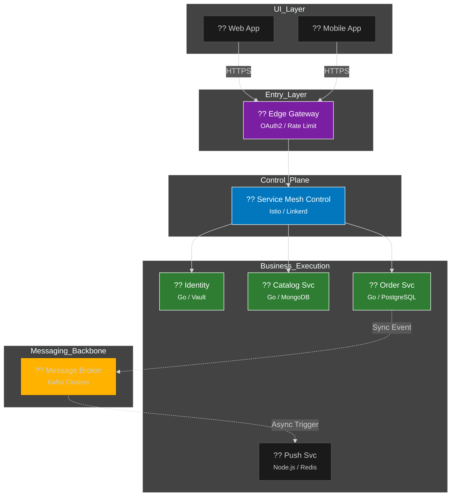

  

  # ?? Microservices 101: Mimari Manifesto & Master Class
  ### Daıtık Sistemlerin Kusursuz Yonetimi ve "Elite" Tasarım Kalıpları
  
  
  
  
  

  **"Kompleksiteyi parala, otonomiyi fethet. Gelecei elite mimarlar ina eder."**

  [? Yol Haritas](#-yol-haritas) • [?? Teknik Derin Dalı](#-teknik-derin-dal) • [?? Mimari](#-mimari-görünüm) • [?? Basit Anlatım](docs/KOLAY-ANLATIM.md) • [?? İleri Seviye Patternlar](#-ileri-seviye-tasarm-kalplar)

  ---

## ?? Vizyon & Felsefe

Bu repo, modern daltık sistemlerin sadece kodlanmasını değil, bir **mhendislik harikas** olarak nasıl tasarlanacaını "Elite" seviyede ele alır. Mikroservislerin "hızlı daltım", "yuksek leklebilirlik" ve "hata dayankllıı" (Fault Tolerance) vaatlerini gerçeğe dnştrmek iin gereken tum cephanelii burada bulacaksın.

---

## ?? Teknik Derin Dalı (Elite Deep Dives)

Modern bir mikroservis sisteminin "Anayasas" olan kritik kavramları aşağıda detaylandırdım.

<b>?? 1. Conway Kanunu ve Ters Conway Manevrası</b>

 
Yazlm mimarisi, organizasyonunuzun iletisim yapısının yansmasıdır. **Inverse Conway Maneuver** kullanarak, istediiniz mimariyi elde etmek iin once ekiplerinizi (Teams) o mimariye uygun hale getirmelisiniz. Otonom ekipler = Otonom servisler.

<b>?? 2. Migration: Strangler Fig Pattern</b>

 
Bir Monolith'i mikroservise cevirmek iin her şeyi bir anda yıkmak intihardır. Bunun yerine "Strangler Fig" (Boan İncir) pattern'ı kullanılır. Yeni ozellikler mikroservis olarak yazılır, eski Monolith'in paraları yava yava mikroservislere aktarılarak Monolith sonunda "bolar" ve yok edilir.

<b>?? 3. Data Patterns: CQRS & Event Sourcing</b>

 
Servislerin veri tabanlarını ayırmak yetmez. Okuma ve Yazma islemlerini (CQRS) paralamak, sistemin performansını 10 kat artırabilir. Event Sourcing ile verinin "en son halini" değil, "oluşum hikayesini" tutarız. Bu sayede geriye donuk tum hataları replay ederek bulabiliriz.

<b>?? 4. Güvenlik: mTLS & Zero-Trust Mesh</b>

 
Sadece kapıda (Gateway) gvenlik yapmak yeterli deildir. Her servisin birbiriyle sertifika (mTLS) uzerinden konusması ve "İçerideki kimseye guvenme" mantııyla hareket edilmesi (Zero Trust) zorunludur.

<b>?? 5. Resilience: Rate Limiting & Circuit Breaker</b>

 
Sistemi asırı ykten (DDoS veya hatalı clientlar) korumak iin **Token Bucket** veya **Leaky Bucket** algoritmalarıyla Rate Limiting uygulanmalıdır. Patlayan bir servise gıden yolu kapatan Circuit Breaker ise sistemin "kendini onarma" (Self-Healing) yeteneğini sağlar.

---

## ?? İleri Seviye Tasarım Kalıpları (The Architect's Toolkit)

Mikroservis sistemlerinde hayati onem tasıyan pattern'lar katalou:

- **Sidecar Pattern:** Loglama, metrik ve gvenlik gibi "ortak" iileri bir container yanına (Sidecar) devretmek. (Kodunuz kirlenmez!).
- **Ambassador Pattern:** Servis dısı iletisimleri (Retry, Logging) yoneten bir vekil sunucu kullanımı.
- **Anti-Corruption Layer (ACL):** Eski (Legacy) bir sistemle yeni mikroservisi konusurken, eski sistemin "kirli" verisinin yeni sistemimizi bozmaması iin araya koyduumuz tercme katmanı.
- **Bulkhead Pattern:** Bir geminin paraları gibi, bir servis cokyorsa digerlerine yayılmaması iin kaynakları (Thread, CPU) izole etmek.

---

## ?? Altyapı & DevEx (Developer Experience)

Mikroservis yazmak, sadece kod yazmak deildir; altyapıyı da kodlamaktır (Infrastructure as Code).
- **IaC (Terraform):** Tum sunucuların kodla yonetilmesi.
- **Service Mesh (Istio):** Servisler arası iletisimi kod yazmadan yonetme katmanı.
- **Local Dev (Telepresence):** lokalinizde calısırken kendinizi Kubernetes cluster'ının bir parçası gibi hissetmenizi salayan elite araclar.

---

## ?? Mimari Görünüm (High-Level Design)

---

## ?? Eğitim Yol Haritas (Elite Roadmap)

Seni bir sistem mimarına dnsturecek progress tablosu:

| Aşama | Modl | Odak Noktası | Durum |
| :--- | :--- | :--- | :---: |
| ?? **Faz 1** | [Giris](docs/01-intro/README.md) | Paradigma Deıişimi & Temeller |  |
| ?? **Faz 2** | [Decomposition](docs/02-decomposition/README.md) | DDD & Servis Parçalama |  |
| ?? **Faz 3** | [Communication](docs/03-communication/README.md) | gRPC & Event-Driven Archi. |  |
| ?? **Faz 4** | [Data Management](docs/04-data-management/README.md) | Saga Pattern & CQRS |  |
| ?? **Faz 5** | API Gateway | Security, Rate Limiting & Auth |  |
| ?? **Faz 6** | Observability | Distributed Tracing & Metrics |  |
| ?? **Faz 7** | Cloud Native | Docker, K8s & GitOps |  |

---

## ?? Neden Go (Golang)?

Neden mikroservis dnyasının lider dili Go?
- **Sıfır Baımlılık:** Statik binary dosyaları ile Docker container'larını sniler içinde ayağa kaldırın.
- **Eszamanllk (Concurrency):** Go kanalları ve routine'leri ile binlerce request'i en duuk CPU ile yonetin.

---

## ?? Katkda Bulunma

Bu bir topluluk ve geliim projesidir. Sen de bu manifestoya katkda bulunabilirsin!
?? **[CONTRIBUTING.md](CONTRIBUTING.md)** belgesine goz at.

---

   
  
   
  Mastering Microservices Architecture ?? <b>arch-yunus</b>

