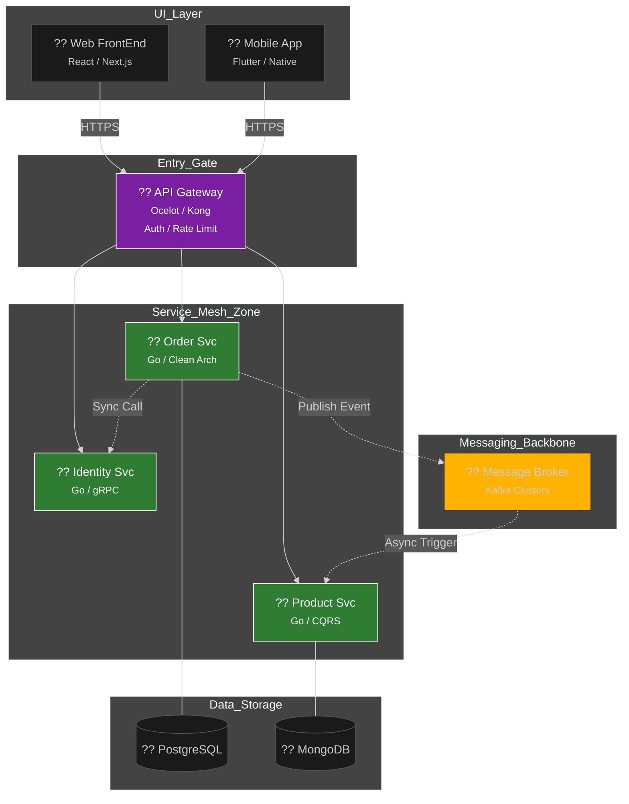

  

  # ?? Microservices 101: Sistem Mimarisinin Nihai Anayasas
  ### Daıtık Sistemlerin Karanlık Dünyasında Stratejik Liderlik
  
  
  
  
  

  **"Karmaşıklığı yönetmek bir yetenek, otonomiyi inşa etmek ise bir sanattır."**

  ---

## ?? Vizyon & Felsefe: Neden Mikroservis? (Derinlemesine Bakış)

Mikroservisler, devasa ve hantal monolitik yapılardan kurtulup, saniyeler içinde daltılabilen, bamsz olarak leklenen ve her biri bir "İ Alanı" (Business Domain) uzmanı olan otonom hcrelerin inşasıdır. Bu bir teknolojik tercih değil, milyar dolarlık trafiği yonetebilecek bir **organizasyonel strateji**dir. 

Gerçek bir mimar bilir ki; mikroservis dnyasında **Otonomi**, her şeyden once gelir. Bir servisi daltırken dier sistemlerin durumunu dşünmek zorunda kalıyorsanız, monolitik bir zincire bağlısınız demektir. Vizyonumuz; sistemlerin sadece calıması değil, kendi kendini iyilestirmesi (Self-Healing) ve her turlu hata senaryosuna karsı dayankllı (Resilient) olmasıdır.

> [!IMPORTANT]
> Mikroservis mimarisi "Design for Failure" (Hata iin Tasarla) prensibiyle yaşar. Sistemde her an bir yerlerin çökeceini kabul eder ve sistemi bu cokuste bile ayakta kalacak şekilde zırhlandırırız.

---

## ?? Teknik Derin Dalı (Architectural Deep Dives)

Aşağıdaki başlıklar, daltık sistemlerin en kritik ve en az anlasılan noktalarını "Elite" seviyede ele alır.

<b>?? 1. Conway Kanunu ve Ters Conway Manevrası (Deep Dive)</b>

 
"Sistemler, tasarlayan organizasyonun iletisim yapısını kopyalar." Bu bir kehanet deil, bir gerçektir. **Inverse Conway Maneuver** kullanarak, hedeflediiniz mikroservis mimarisini elde etmek iin once ekiplerinizi (Teams) bu mimariye gore paralamalısınız. Eer 100 kisilik tek bir "Dev" ekibiniz varsa, mikroservis yazmaya calırsanız ortaya "Daltık bir Monolith" çıkar. Ekipler otonomsa, servisler de otonomdur.

<b>?? 2. Migration Stratejisi: Strangler Fig Pattern (The Master's Way)</b>

 
Canlıdaki bir Monolith'i mikroservise cevirmek, gıden bir arabann motorunu deitirmeye benzer. **Strangler Fig Pattern** ile bu sureci "boğarak" yonetiriz. Yeni ozellikler mikroservis (The Fig) olarak yan tarafına eklenir ve bir Proxy (Facade) katmanı ile trafik yava yava Monolith'ten (The Host) yeni servislere akıtılır. Zamanla Monolith kuculur ve sonunda bamsz servisler tarafından tamamen sarılarak yok edilir. Bu, sıfır riskle buyuk gclerin anahtarıdır.

<b>?? 3. Gelişmiş Veri Patternları: CQRS & Event Sourcing</b>

 
Tek bir veritabanı şeması hem yazma (Command) hem okuma (Query) iin mukemmel olamaz. **CQRS** ile bu sorumlulukları keskin bir sekilde paralarız. Yazma islemlerini tutarlı bir PostgreSQL'de yaparken, okuma islemlerini (Searching/Reporting) Elasticsearch veya Redis uzerinden milisaniyeler iinde bitiririz. **Event Sourcing** ile dnyanın en iyi Audit Log'unu tutarız; verinin son halini değil, veriyi o hale getiren tum tarihsel olayları saklarız.

<b>?? 4. Haberleşme: gRPC (Internal) vs REST (External)</b>

 
Mikroservisler arası iletisimde JSON (REST) kullanmak, yarıs arabasına traktor motoru takmak gibidir. İç haberleşmede **gRPC (HTTP/2 + Protocol Buffers)** kullanarak binary formata gecer, network yukunu %60 azaltır ve tip-guvenli (Strongly Typed) bir iletisim kurarız. REST ise API Gateway seviyesinde, dnyaya acılan kapı olarak esnekliği ve tarayıcı destei iin yerini korur. Bu hibrit yapı, modern mimarinin standartıdır.

<b>?? 5. Resilience: Bulkhead Pattern & Circuit Breaker</b>

 
Bir geminin paraları neden birbirinden yalıtılmıtır? Bir taraftan delik acılırsa tum gemi batmasın diye. **Bulkhead Pattern** ile sistemin kaynaklarını (CPU/Threads) servisler arası izole ederiz. **Circuit Breaker** (Sigorta) ise cokmeye baslayan bir servise gıden yolu bir sure kapatır (Open Circuit), sistemin "Kendini Onarma" surecine zaman tanır. Bu sayede bir servis kerse, sadece o servis ker; tum sistem deil.

---

## ?? İleri Seviye Tasarım Kalıpları (The Architect's Toolkit)

Mikroservis sistemlerinde hayati onem tasıyan, "Senior" ve "Staff" seviye mimarların kullandıı pattern'lar:

- **Anti-Corruption Layer (ACL):** Eski (Legacy) sistemlerin kirli verisinin, yeni tertemiz mikroservis dnyamızı zehirlemesine izin vermeyiz. ACL katmanı arada bir "filtre" gorevi gorur.
- **Ambassador Pattern:** Servis dısı iletisimi (Retry, Timeout, Logging) yoneten bir vekil sunucu. Uygulama kodunuz sadece isiyle ugrasır, network dertlerini Ambassador'a bırakır.
- **Outbox Pattern:** Bir veritabanı islemini bitirdiinde "Mutlaka mesaj yolla" garantisi vermek iin, mesajları once kendi veritabanımızdaki bir tabloya (`outbox`) yazar ve bir "Relay" araclııyla gondeririz. (Atomicity in Distributed Systems).

---

## ?? Mimari Görünüm (High-Level Strategy Map)

---

## ?? Eğitim Yol Haritas (The Elite Roadmap)

| Aşama | Modl | Odak Noktası | Durum |
| :--- | :--- | :--- | :---: |
| ?? **Faz 1** | [Giris](docs/01-intro/README.md) | Paradigma Deıişimi & Neden Mikroservis? |  |
| ?? **Faz 2** | [Decomposition](docs/02-decomposition/README.md) | DDD & Bounded Context Snırları |  |
| ?? **Faz 3** | [Communication](docs/03-communication/README.md) | gRPC (Internal) vs REST (External) |  |
| ?? **Faz 4** | [Data Management](docs/04-data-management/README.md) | Saga Pattern & Compensating Trans. |  |
| ?? **Faz 5** | API Gateway | Rate Limiting, Security & OIDC |  |
| ?? **Faz 6** | Observability | Distributed Tracing & Central Logs |  |
| ?? **Faz 7** | Cloud Native | Kubernetes & GitOps Pipelines |  |

---

   
  
   
  Achieving Architectural Excellence ?? <b>arch-yunus</b>

