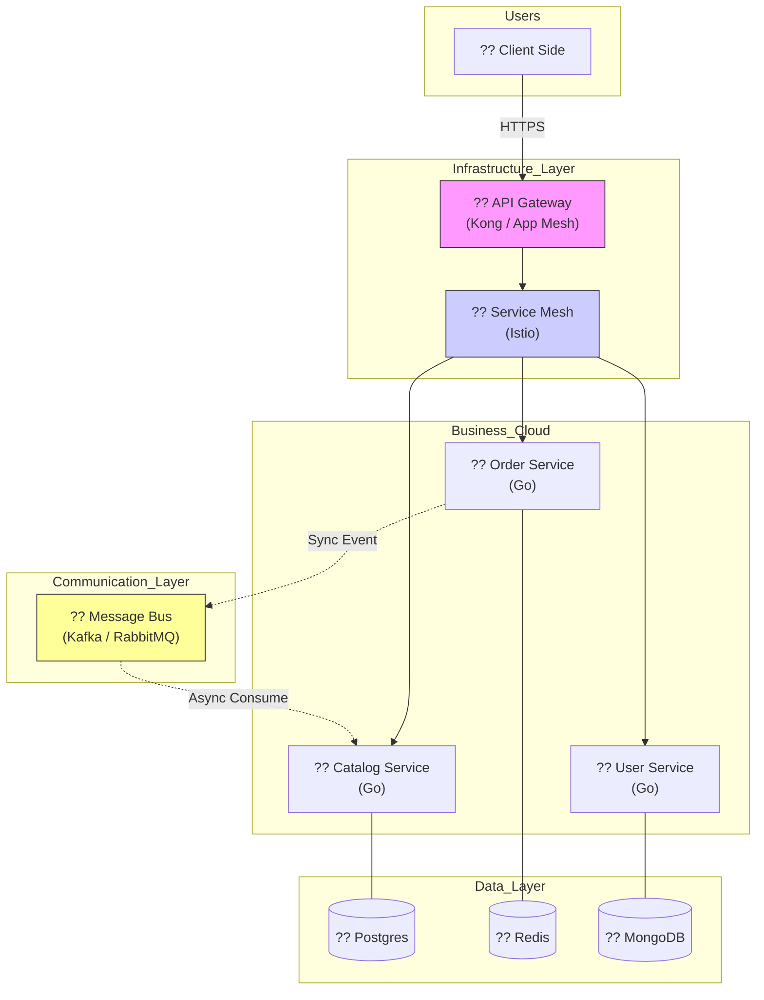

  

  # ?? Microservices 101: Mimari Ansiklopedisi & Manifesto
  ### Daıtık Sistemlerin Kalbine Yolculuk
  
  
  
  
  

  *Modern, daltık ve leklenip yonetilebilir sistemlerin "Elite" rehberi.*

  ---

## ?? Mikroservis Nedir? (Felsefi ve Teknik Bakış)

Mikroservisler, devasa bir yazlmı, her biri belirli bir **Business Domain**'e odaklanan, otonom ve bamsz servislerin birleşimi olarak tasarlamaktır. Bu bir teknoloji semimi deil, bir **organizasyonel strateji**dir.

> [!CAUTION]
> **Conway Kanunu:** "Sistemleri tasarlayan her organizasyon, o organizasyonun iletisim yapısını kopyalayan sistemler üretir." 
> Mikroservis, ekibinizi de paralamanızı gerektirir. Küçük, "Two-Pizza Teams" (İki pizzayla doyan ekipler) mikroservisin ruhudur.

---

## ?? Mimari Evrim: Neden Buradayız?

1.  **Monolith:** Her şey tek bir yerdedir. Daltımı kolay ama buyutmesi ve teknolojiyi deistirmesi imkansızdır.
2.  **SOA (Service Oriented Architecture):** Servisler vardır ama genellikle devasa bir **ESB (Enterprise Service Bus)**'a banlıdır. Karmaıktır.
3.  **Microservices:** Her servis bamszdır, hafiftir ve bamsz daltılabilir (Independently Deployable).

---

## ?? 12-Factor App: Modern Uygulamanın 12 Kuralı

Bir mikroservisin "Cloud-Native" olması iin u kurallara uyması gerekir:
1. **Codebase:** Tek bir depo, cok daltım.
2. **Dependencies:** Tüm baımlılıklar net tanmlanm olmalı.
3. **Config:** Ayarlar (DB siferleri vb.) ortam deiskenlerinde (Environment Variables) tutulmalı.
4. **Backing Services:** Veritabanı vb. her ey banlanabilir bir kaynak olmalı.
5. **Build, Release, Run:** Bu sureler birbirinden kesin snırlarla ayrılmalı.
6. **Processes:** Uygulama "Stateless" (Durumsuz) olmalı. Veriyi bellekte deil, DB'de tutmalı.
7. **Port Binding:** Uygulama kendi portunu darya açabilmeli.
8. **Concurrency:** İşleri paralel yurtebilmek iin "Process Model" kullanılmalı.
9. **Disposability:** Hizlı balayıp hzl ve gvenli kapanabilmeli (Graceful Shutdown).
10. **Dev/Prod Parity:** Yerel ortam ve canlı ortam birbirine olabildiince yakın olmalı.
11. **Logs:** Loglar bir "Event Stream" (Olay Akıı) olarak ele alınmalı.
12. **Admin Processes:** Yonetimsel ipler normal kodun bir parası olmalı.

---

## ?? Gelişmiş Tasarım Kalıpları (Design Patterns)

### 1. CQRS (Command Query Responsibility Segregation)
Yazma (Command) ve Okuma (Query) islemlerini paralamak. 
- **Neden?** Okuma islemleri (Raporlama) cok yk yaratsa da, yazma (Siparis) islemleri cok kritiktir. İkisini ayırarak sistemi mukemmel leklebiliriz.

### 2. Event Sourcing
Veritabanında "Anlık Durum"u tutmak yerine, oluan tm "Olaylar" (Events) serisini tutmak.
- **Ornek:** Banka bakiyesini değil, tm para giriş/çıkış hareketlerini tutarsın. İstediin ana "Replay" yaparak geri donebilirsin.

### 3. Saga Pattern (Dağıtk İslemler)
Birden fazla servisi ilgilendiren bir islemde veri tutarlılıını salamak iin kullanılır.
- **Choreography:** Servisler birbirine haber verir.
- **Orchestration:** Bir yonetici servis i akısını yonetir.

---

## ?? Güvenlik: Sıfır Güven (Zero Trust)

Mikroservislerde "İç ağ gvenlidir" mantıı olmzmz.
- **API Gateway:** Tüm istekler tek bir kapıdan gırer. Burada JWT kontrolu, Rate Limiting yapılır.
- **mTLS (Mutual TLS):** Servisler birbirleriyle konusurken karşılıklı sertifika dorulaması yapar.
- **RBAC:** Kullanıcıların rolleri servisler arası tasınır.

---

## ?? Gözlemlenebilirlik (Observability)

Karanlıkta yol bulmanın 3 yolu:
1. **Tracing (Jaeger):** Bir isteğin hangi servislerden getiini milisaniye milisaniye gosterir.
2. **Metrics (Prometheus):** RAM/CPU ve hata oranlarını grafiklestirir.
3. **Logging (ELK Stack):** Tm hata mesajlarını bir merkezde toplar.

---

## ?? Test Stratejisi

Mikroservis sisteminde "Unit Test" yetmez.
- **Contract Testing (Pact):** Servis A deistiinde Servis B bozuluyor mu? Bu test servisler daltılmadan (Deployment) once yapılır.
- **Chaos Engineering:** "Eer bir servisi rastgele kapatırsak ne olur?" sorusunun yanıtı aranır (Netflix Simian Army).

---

## ?? Anti-Patterns: Nelerden Kacmalısın?

1. **Nano-services:** Servisi cok kk paralamak. (Yonetim yukunu artırır).
2. **Shared Database:** İki servisin aynı DB'yi kullanması. (Olumcul hatadır).
3. **Mega-Service:** Adı mikro kendisi monolit olan devasa servisler.

---

## ?? Mimari Görünüm

---

## ?? Eğitim Yol Haritas (Roadmap)

| Modl | Konu | İeerik | Durum |
| :--- | :--- | :--- | :--- |
| **01** | [Giris](docs/01-intro/README.md) | Paradigma Değisimi & Neden Mikroservis? | ?? Tamamlandı |
| **02** | [Decomposition](docs/02-decomposition/README.md) | DDD, Bounded Context & Servis Parçalama | ?? Tamamlandı |
| **03** | [Communication](docs/03-communication/README.md) | gRPC, REST & Messaging Patterns | ?? Tamamlandı |
| **04** | [Data Management](docs/04-data-management/README.md) | Saga Pattern, CQRS & DB per Service | ?? Tamamlandı |
| **05** | API Gateway | Security, Rate Limiting & Auth | ?? Yaknda |
| **06** | Observability | Tracking, Metrics & Logging | ?? Yaknda |
| **07** | CI/CD | Docker, K8s & Cloud Deployment | ?? Yaknda |

---

  Elite Microservices Architect Journey ?? <b>arch-yunus</b>

