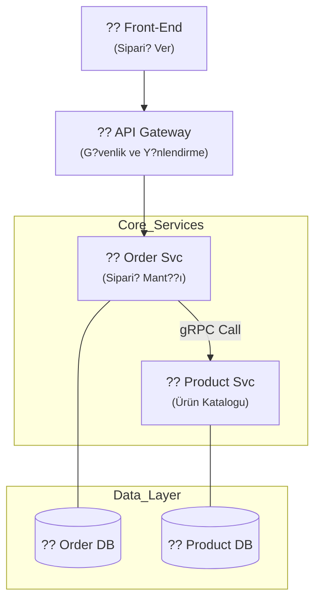

<div align="center">
  

  # ?? Microservices 101: Srıdan Zirveye Mimari Yolculuk
  ### Daıtık Sistemleri Bir Mhendis Gibi Tasarlamay örenin
  
  [](LICENSE)
  [](https://go.dev)
  [](https://github.com/arch-yunus/microservices-101)

  **"Bir sistem sadece kod deildir; o bir ya?ayan organizmadr. Onu b?lmeyi, konusturmay? ve ya?atmay? oreniyoruz."**

  ---
</div>

## ?? Giri?: Mikroservis Nedir? (Gerçekten!)

Mikroservis, b?y?k bir ?e?liyi tek bir b?y?k tencerede (Monolith) kaynatmak yerine, her yeme?i kendi k???k tenceresinde pi?irmektir. E?er salataya sinek d??erse sadece salatay? d?keriz, t?m mutfak (Sistem) zehirlenmez. 

Bu rehberde, bir **Elite Architect** gibi d???nmeyi ve karma?alar? nas?l y?neteceklerinizi adım adım ?ğreneceksiniz.

---

## ?? Bölüm 1: Monolith Krizi ve Evrim ??

Her ?ey m?kemmel ba?lad?. Tek bir proje, tek bir veritaban?. Ama ?irket b?y?d?, ekip 100 ki?i oldu. Herkes ayn? dosyalar? d?zenlemeye ?al???yor, t?m d?nya ayn? hata nedeniyle ??k?yordu.

- **Neden Değiştik?**
    - **Hantal Yap?:** Tek bir sat?r de?i?iklik iin saati bulan derleme (build) s?releri.
    - **Hata Yayılım?:** Login sayfasındaki bir hata nedeniyle ?deme sisteminin ??kmesi.
    - **Teknoloji Esareti:** 10 y?ll?k bir projeyi yeni bir dille (örn: Go) yazmaya ?al??man?n imkans?zl???.

---

## ?? Bölüm 2: Parçalama Sanat? (DDD & Bounded Context) ??

Bir sistemi par?alara b?lerken en b?y?k tehlike, "yanl?? yerden" b?lmektir. **Domain-Driven Design (DDD)** bize "Context"leri ??retir.

- **Bounded Context:** Bir kavramın (örn: Product) bir serviste ba?ka anlamı, dər serviste ba?ka anlamı vardır. 
    - **Catalog Service**: Ürün fiyatı ve tanımıyla ilgilenir.
    - **Order Service**: Ürünün stok durumu ve teslimatıyla ilgilenir.

> [!TIP]
> Bizim projemizde `services/product-service` ve `services/order-service` olarak bu ayrımı yaptık. Her servis kendi d?nyas?ndan sorumludur.

---

## ?? Bölüm 3: Sistemin Nabzı (Haberleşme & gRPC) ??

Parçalar? birbirine nas?l ba?lar?z? Eğer hepsi s?rekli birbirini beklerse monolith'ten daha yava? bir sistemimiz olur.

1.  **gRPC (Senkron/Anl?k):** 
    - **Neden?** Ultra h?zl?, tip g?venli. 
    - **Bizim Kodumuzda:** `Product Service` ve `Order Service` birbirleriyle gRPC ?zerinden proto dosyalar?ndaki kurallara g?re konu?urlar. 📡⚡
2.  **Mesajlaşma (Asenkron/Olay Odakl?):** 
    - **Neden?** Bir servis o an kapal? olsa bile i?ler durmaz, mesajlar kuyrukta (Kafka/RabbitMQ) bekler. 📩

---

## ?? Bölüm 4: Veri Yönetimi (En Zor Kısım!) ??

Mikroservis d?nyasının 1 numaral? kuralı: **Herkesin kendi veritabanı vardır.** Salatacı, k?ftecinin dolabını a?amaz!

- **Saga Pattern:** İki farklı servisteki veritaban?nda i?lem yapmam?z gerekirse (örn: Stok d?? ve ?deme yap), bunu "Distributed Transaction" yerine Saga ile yaparız. Eğer biri ba?ar?s?z olursa dierini geri al?rız (Compensating Transaction).
- **CQRS:** Okuma ve Yazma i?lemlerini ayr?m?aktır. Sisteminiz saniyede 1 milyon okuma alıyorsa, bunu sadece okuma iin optimize edilmi? bir Redis/NoSQL katman?na yıkmak elite bir harekettir.

---

## ?? Bölüm 5: Operasyonel Mükemmellik & Lab 🧪

Artık teori bitti, mikroservislerini ayağa kaldırıp saniyeler iinde g?rmenin vaktidir.

### ?? Pratik Lab (Lab Instructions)
Bu projenin t?m par?aları, senin onkolayca ?al??tırman iin `Makefile` ile zırhlandırıldı:

```bash
# 1. Altyapıyı (Postgres, RabbitMQ, Redis) uykusundan uyandır:
make up

# 2. Product Service'i (Go sunucusu) başlat: (Farklı terminal)
make run-product

# 3. Order Service'i çalıştır ve gRPC sihrini g?r: (Farklı terminal)
make run-order
```

### ?? Mimari Görünüm (Teaching Strategy)


---

## ?? Final: Elite Mimarlar Yol Haritası 🗺️

Seni bir mikroservis ustas? yapacak olan bu daldaki ilerlememizi takip et:

| Adım | Konu | Durum |
| :--- | :--- | :---: |
| ?? **Faz 1** | Temeller ve Paradigma |  |
| ?? **Faz 2** | Clean Architecture (Kod Yapıs?) |  |
| ?? **Faz 3** | gRPC ile Servisler Arası İletişim |  |
| ?? **Faz 4** | Docker & Containerization |  |
| ?? **Faz 5** | API Gateway & Security |  |
| ?? **Faz 6** | Saga Pattern & Mesajla?ma |  |

<div align="center">
  <br/>
  <sub>Mastering Microservices Architecture ?? <b>arch-yunus</b></sub>
  <br/>
  
</div>
